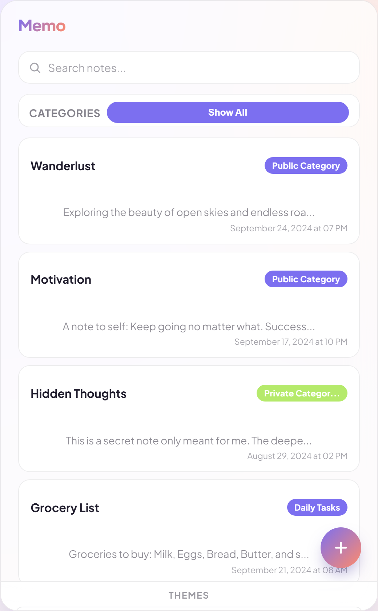
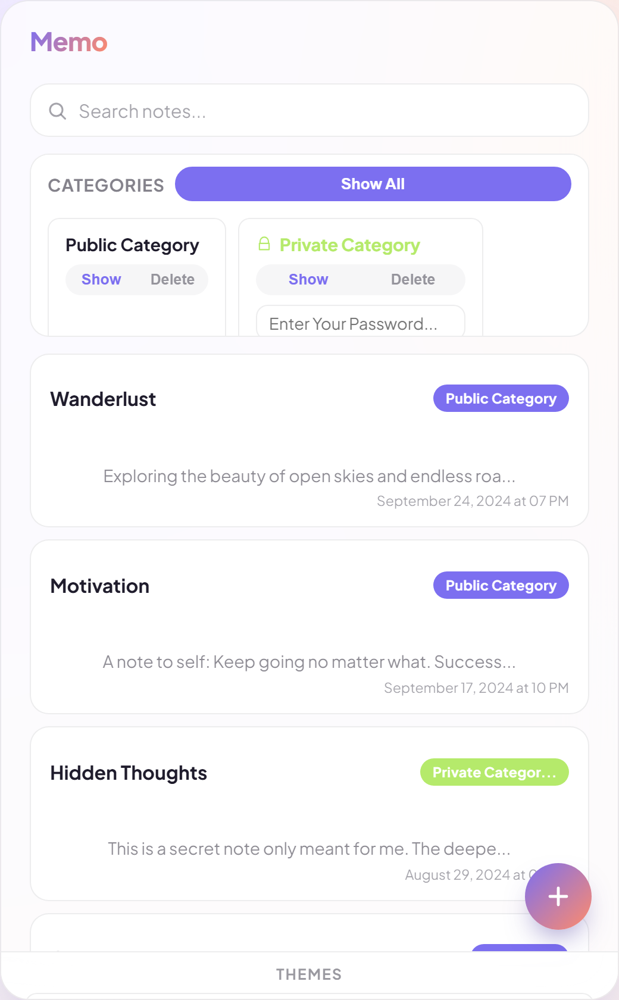
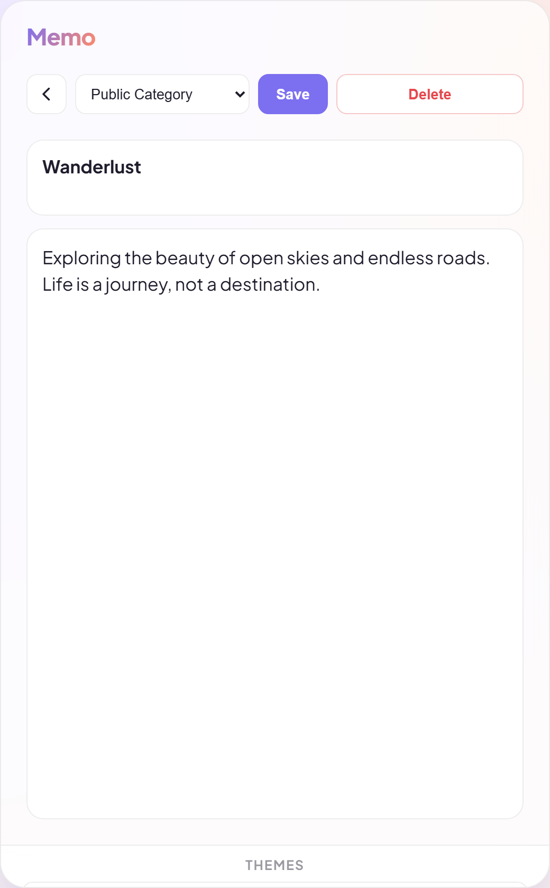
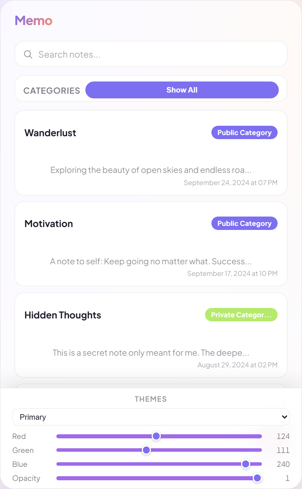

# Memo

A simple notes app — public and password-protected private categories, search, and a live theme color picker. It's a React frontend backed by an ASP.NET Core + SQL Server API, but the frontend doesn't actually need the backend running to be usable: if the API isn't reachable, notes and categories save to your browser's local storage instead, so you can poke around without spinning up SQL Server.



## What it does

**Notes with categories** — every note belongs to a category, and categories are either public or private. Private ones are password-protected: set a password when you create one, and viewing its notes requires entering it again.

**Search** across note titles and content, live as you type.



**A clean note editor** — title and content, a category picker, save and delete. Validation errors from the API (or a friendly fallback message if it's unreachable) show inline instead of just failing silently.



**A live theme color picker** — instead of a fixed set of presets, you drag RGB/HSL sliders for the primary, secondary, accent, and font colors and watch the whole app re-skin itself instantly. It works by writing straight to CSS custom properties, so there's no re-render cost.



**Works without a backend.** If the API can't be reached, reads fall back to a bundled sample dataset and writes (add/edit/delete note or category) fall back to `localStorage`, so edits still persist across reloads. Handy for a project you don't want to keep a SQL Server instance running for just to look at.

## Stack

**Frontend:** React 18 + Vite, React Router, react-transition-group for the page-slide animation, Axios.

**Backend:** ASP.NET Core 8 Web API, Entity Framework Core 8 with SQL Server, Swagger/Swashbuckle.

## Running it

### Frontend only (no backend needed)

```bash
cd Frontend
npm install
npm run dev
```

Then open `http://localhost:3000`. Without a reachable API it automatically runs on sample data and `localStorage`.

### Full stack

Start the API first — it needs a SQL Server instance and a connection string in `api/appsettings.json` (or an override in `api/appsettings.Development.json`) pointed at it, then apply migrations:

```bash
cd api
dotnet ef database update
dotnet run
```

It listens on `http://localhost:5000` by default, which is what the frontend's Axios calls target. Then start the frontend as above — it'll talk to the real API instead of falling back to local data.

## Deploying to GitHub Pages

Only the frontend deploys to Pages — there's no backend there, so it runs entirely on sample data and `localStorage`, per the fallback behavior above.

A workflow at `.github/workflows/deploy-pages.yml` builds `Frontend/` and publishes it on every push to `master`. One-time setup: in the repo's **Settings → Pages**, set **Source** to **GitHub Actions**. After that, pushes to `master` that touch `Frontend/` deploy automatically; you can also trigger it manually from the Actions tab.

Alternatively, deploy by hand from your machine:

```bash
cd Frontend
npm run deploy
```

This builds and pushes `dist/` to a `gh-pages` branch (via the `gh-pages` package). If you use this method instead, set Pages' **Source** to **Deploy from a branch** → `gh-pages`.

## Project layout

- `Frontend/src/components/` — `NotesList`, `Note`, `NoteAdd`, `Categories`, `SearchBar`, `ThemeColors`
- `Frontend/src/api calls/ApiCalls.js` — the Axios client, with a per-call fallback to `localData.js` when the API is unreachable
- `Frontend/src/Sample Data/sample.js` — the seed data used when there's nothing in local storage yet
- `api/Controllers/`, `api/Data/`, `api/Dtos/`, `api/Mappers/` — standard ASP.NET Core Web API layout: controllers, EF Core `DbContext`, request/response DTOs, and the mapping between them
- `api/Migrations/` — EF Core migration history
